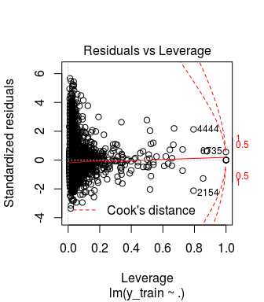

Using predictive models to estimate price
================
Christian Braz
April 2018

Introduction
============

Airbnb is an American company which operates an online marketplace and hospitality service for people to lease or rent short-term lodging including holiday cottages, apartments, homestays, hostel beds, or hotel rooms, to participate in or facilitate experiences related to tourism such as walking tours, and to make reservations at restaurants. The company does not own any real estate or conduct tours; it is a broker which receives percentage service fees in conjunction with every booking. Like all hospitality services, Airbnb is an example of collaborative consumption and sharing. The company has over 4 million lodging listings in 65,000 cities and 191 countries and has facilitated over 260 million check-ins.

One important issue regarding Airbnb is the property price. A new host would want to know how to set a proper value for her new advertised property. An old one would to know how her announcements compare with others similar to verify, for instance, whether they are being competitive. Yet, from the final user perspective, one wants to know about good bargains, i.e., properties that are being offered for a price inferior than expected.

Answering these questions encompass many concerns. The first one is: how to define the correct price of a property? What metric one should employ? Maybe the most common first insight would be using the average. Group similar properties, take the mean, and you would recommend the price of some place as the medium price of several similar properties. But now, how to create a group? What similarity metric should be employed? Group by location? But what if in the same location there are fairly different prices? Maybe location and some other characteristic of the property like number of bedrooms and bathrooms or whether it has Air conditioning, Internet and a disabled parking spot or not? As we can see, it is not an easy task. But guess what, we can use a statistical model to automatically capture the significant relationship information among all the variables and our goal, the price.

The aim of this work is trying to fit a robust linear model to predict the price of a property in the Airbnb real state service. It is worth noting that, as always, we are limited to the level of information contained in publicly available datasets. It is organized in the following way:

-   Dataset description
-   Data cleaning and exploratory data analysis
-   Generalized Linear Model
    -   Ordinary Least Square
    -   Lasso
    -   Interaction
-   Conclusion

Dataset description
===================

The specific Washington - DC [Airbnd dataset](http://insideairbnb.com/get-the-data.html) has 7788 rows and 95 variables.

Data cleaning and exploratory data analysis
===========================================

In this section we briefly show the most important steps we have done in the preparation of our dataset. After removing nominal variables, either because they are useless or because we can not deal with them (text processing), treating missing values and changing long column names to shorter ones, we analyze the response variable **price**. First, the boxplot for it:

We can infer based on the boxplot that the price for most properties is below 400 dollars. All the values above are treated as outliers. Hence, it seems reasonable to build two different models, one for regular (medium) properties, and other for luxury ones. This way we could specialize the analysis and fit more accurate models. Then, we remove from our dataset all properties whose price is above U$400,00, and focus in this work solely on the most common prices. The new boxplot after removing prices is:

Other important step is transform amenities in a way suitable to being used. This variable comes originally in the following way:

> {TV,Internet,Wireless Internet,Air conditioning,Kitchen,Free parking,Pets allowed}

These are all the specific characteristics of a property and bring much information about them. Thus, we extract each one of each property and make them available for the model.

Generalized Linear Model
========================

Ordinary Least Square
---------------------

After an extensive preprocessing step, we fit our first linear model. Its main characteristics are:

-   Using all variables (remaining after the cleaning phase).
-   Encoding of nominal variables (one-hot encoding).
-   No kind of data transformation (neither on the predictors or on the response).
-   No interaction terms

<!-- -->

    ## [1] "Test RMSE OLS: 79.888446"

    ## 
    ##  Shapiro-Wilk normality test
    ## 
    ## data:  sample(model1$residuals, 100)
    ## W = 0.84248, p-value = 6.316e-09

Lets start assessing some diagnostics of the model.

> Residual standard error: 74.58 on 5290 degrees of freedom

> Multiple R-squared: 0.5014, Adjusted R-squared: 0.4799

> F-statistic: 23.23 on 229 and 5290 DF, p-value: &lt; 2.2e-16

We can see that the RSE is 74.5. RSE is an accuracy metric difficult to evaluate alone as it does not have any implicit baseline for comparison. On the other hand, adjusted R-squared and F-statistics are good to capture the overall performance of the model. Both are telling that the model is significant, i.e., there is at least one variable highly correlated with price and roughly 50% of the variability is being explained. But our objective is build a robust model to explain price, and we are not satisfied with this numbers. The error in test time is 79.88, as expected a little bit higher than the training RSE.

Now lets take a look in the plots. The top left shows the "residuals plot" (y axis are the residuals of the model and x axis are the predicted values). This plot is important because we can validate whether certain assumptions of a linear model are being held. These assumptions are:

1.  Linearity of the relationship between dependent and independent variables.
2.  Independence of the errors terms.
3.  Constant variance of the errors terms.
4.  Normality of the error distribution.

Linear regression model assumes that there is a straight-line relationship between the predictors and the response. If the true relationship is not linear, then all the conclusions would be suspect. Residual plots are a useful graphical tool for identifying non-linearity. Ideally, the residual plot will show no discernible pattern. The presence of a pattern may indicate a problem with some aspect of the linear model. If the residual plot indicates that there are non-linear associations in the data, then a simple approach is to use non-linear transformations of the predictors or the response, such as log or quadratic. The constant variance of the error terms means that the error terms have the same variance. So, no matter in each point on the line you analyze the variance, it will be roughly the same. What you hope not to see are errors that systematically get larger in one direction by a significant amount. One can identify non-constant variances in the errors (or heteroscedasticity) from the presence of a funnel shape in the residual plot.

The top right plot shows that the errors do not follow a normal distribution what is confirmed by the Shapiro-Wilk test with a very small p-value. The two others right below confirm the problems and show that possibly there are dangerous outliers and high leverage points.

Hence, analyzing the residual plot, we can observe a non-linear pattern in the graph and also a kind of funnel shape, what is a strong sign of non-linearity and heteroscedasticity. To improve our model, we now employ a **log** transformation on the response variable price. The log transformation is proper in this situation because price does not have neither zero, nor negative values. Below we can verify the results for this second model.

    ## [1] "Log test RMSE OLS: 4.380631"

    ## [1] "Test RMSE OLS log transform: 0.439169"

    ## 
    ##  Shapiro-Wilk normality test
    ## 
    ## data:  sample(model3$residuals, 100)
    ## W = 0.96087, p-value = 0.004643

The performance of this model is superior.

> Residual standard error: 0.4123 on 5290 degrees of freedom

> Multiple R-squared: 0.5931, Adjusted R-squared: 0.5755

> F-statistic: 33.67 on 229 and 5290 DF, p-value: &lt; 2.2e-16

We can see that R-squared and F-statistic increased. Also, now there are no discernible pattern in the residual plot anymore and the error terms are much more normal (Shapiro-Wilk p-value much higher), despite the presence of outliers and high leverage points. However, the most impressive result was the sensible decrease in the test RSE, from 4.4 (to be able to compare the results we took the natural log of 79.9) to 0.44. It is almost 10 times lower. From now on, all the tests are performed on a log-scaled price.

Lasso
-----

Our next attempt is to experiment the Lasso model to verify whether some normalization would improve the performance even more and also trying to make feature selection. To do so, we have used the **glmnet** package with the *alpha* parameter seted to 1 (which implies Lasso). First we run *cv.glmnet* to determine the best *lambda* and then we predict using the test set and calculate the error. The results are as follow.

    ## [1] "Test RMSE Lasso (0.438960) with lambda as 0.009374 "

We do not note any expressive improvement in the test error. Maybe regularization does not play an important role in this problem because the OLS is well suited for the data. In other words, OLS has the right complexity. We now use the features selected by Lasso to fit Lasso and OLS again.

The results are the following.

    ## [1] "Models with features selected by Lasso - 77 predictors"

    ## [1] "Test RMSE Lasso: 0.437902"

    ## [1] "Test RMSE OLS: 0.433062"

> Residual standard error: 0.4148 on 5443 degrees of freedom

> Multiple R-squared: 0.5762, Adjusted R-squared: 0.5703

> F-statistic: 97.37 on 76 and 5443 DF, p-value: &lt; 2.2e-16

The model is still significant, with no improvement in R-squared and a slight decrease in test RSE.

In our final attempt trying to get the most robust liner model possible, we employ a backward feature selection strategy to reduce the number of features even more. After some experimentation, we find a good middle term being 40 features. The results for this model are:

    ## Reordering variables and trying again:

| term                             |      estimate|   statistic|    p.value|
|:---------------------------------|-------------:|-----------:|----------:|
| (Intercept)                      |  -229.5241363|  -10.756595|  0.0000000|
| host\_listings\_count            |    -0.0000412|   -0.626450|  0.5310459|
| latitude                         |    -3.4280568|   -9.574696|  0.0000000|
| longitude                        |    -4.7650971|  -16.097045|  0.0000000|
| accommodates                     |     0.0586294|   12.293630|  0.0000000|
| bathrooms                        |     0.0830979|    6.569641|  0.0000000|
| bedrooms                         |     0.1415762|   12.358140|  0.0000000|
| extra\_people                    |     0.0011081|    4.094767|  0.0000429|
| minimum\_nights                  |    -0.0026347|   -3.459128|  0.0005461|
| review\_scores\_cleanliness      |     0.0447990|    5.509489|  0.0000000|
| review\_scores\_communication    |    -0.0372217|   -4.171443|  0.0000307|
| review\_scores\_value            |    -0.0302295|   -3.428885|  0.0006105|
| reviews\_per\_month              |    -0.0331826|   -9.717976|  0.0000000|
| zipcode20007                     |    -0.2668981|   -5.955941|  0.0000000|
| zipcode20016                     |    -0.2996316|   -6.406178|  0.0000000|
| zipcode20032                     |    -0.3474937|   -4.445555|  0.0000089|
| `property_typeBed & Breakfast`   |     0.2915663|    4.665180|  0.0000032|
| property\_typeDorm               |    -0.6016951|   -5.561489|  0.0000000|
| property\_typeTimeshare          |     1.1689800|    2.772845|  0.0055756|
| `room_typeEntire home/apt`       |     0.9488510|   24.725301|  0.0000000|
| `room_typePrivate room`          |     0.5813601|   15.275939|  0.0000000|
| instant\_bookablef               |    -0.0596480|   -4.535045|  0.0000059|
| cancellation\_policyflexible     |    -0.3182274|   -4.476850|  0.0000077|
| cancellation\_policymoderate     |    -0.3346629|   -4.722189|  0.0000024|
| cancellation\_policystrict       |    -0.3477160|   -4.969354|  0.0000007|
| `neighbourhoodCapitol Hill`      |     0.2673197|   10.786389|  0.0000000|
| neighbourhoodDowntown            |     0.3076026|   10.685256|  0.0000000|
| `neighbourhoodDupont Circle`     |     0.1592418|    6.615516|  0.0000000|
| neighbourhoodGeorgetown          |     0.3834001|    7.287286|  0.0000000|
| `neighbourhoodHoward University` |     0.1865218|    6.635429|  0.0000000|
| `neighbourhoodNear Southeast`    |     0.2313126|    3.265913|  0.0010978|
| neighbourhoodShaw                |     0.2060317|    8.594006|  0.0000000|
| `neighbourhoodUnion Station`     |     0.2340804|   10.576310|  0.0000000|
| `Air conditioning`               |    -0.1099818|   -3.749320|  0.0001791|
| Shampoo                          |     0.0719231|    5.229846|  0.0000002|
| `Indoor fireplace`               |     0.0690982|    4.010328|  0.0000614|
| Breakfast                        |     0.0563530|    3.252523|  0.0011508|
| `Self Check-In`                  |    -0.0475596|   -3.050710|  0.0022939|
| Gym                              |     0.0493522|    2.646696|  0.0081515|
| `Wireless Internet`              |    -0.1154349|   -3.477762|  0.0005095|
| TV                               |     0.1288072|    8.659186|  0.0000000|

    ## [1] "Test RMSE OLS: 0.434426"

> Residual standard error: 0.4202 on 5479 degrees of freedom

> Multiple R-squared: 0.5623, Adjusted R-squared: 0.5591

> F-statistic: 175.9 on 40 and 5479 DF, p-value: &lt; 2.2e-16

In this more interpretable model, despite the little reduction in the R-squared, we can note that even with just forty predictors the test RSE is the same as the previous with 77. We can also draw some conclusions:

-   Even small, breakfast has a positive impact.
-   A couple of good neighbourhood.
-   Wireless Internet is not good (weird).

Interaction
-----------

Identify whether there are synergy between the predictors can make a big difference in the overall performance of the model. It is a computational expensive task but as now we have only forty predictors we can try. Next, we present the result of our last model, in which we are assessing the interaction of all variables two by two. We could not evaluate more than two due to the limitations of our computational resources.

    ## [1] "Test RMSE OLS: 0.458178"

> Residual standard error: 0.3934 on 4844 degrees of freedom

> Multiple R-squared: 0.6607, Adjusted R-squared: 0.6135

> F-statistic: 13.98 on 675 and 4844 DF, p-value: &lt; 2.2e-16

It is the first time we get a R-squared bigger than 0.6.

Conclusion
==========

In this work we conduct an analysis trying to fit a robust linear model to estimate price in Airbnb dataset. Having a good price prediction is valuable to understand the Airbnb market better and the company can use it as insight to make more informed decisions. The host can have a more precise ideia about the current value of its property, and decide whether want to be more competitive or more eager. The guest can make better choices and catch the opportunities available.

We begin fitting a standard linear model which shows some disabilities due to problems such as non-linearity of the data. Then, we apply a log transformation on price in the attempt of making the data more linear and the errors more normally distributed. As a result of such transformation, we get a more stable data and an overall better model. Next we try employ some regularization via Lasso regressor which did not show any significant improvement in the test RSE. Using the feature selection capability of Lasso, we fit new models, all of them showing similar accuracy of the previous. Not satisfied, we use a backward feature selection strategy to reduce the number of features. Now we have just forty features capturing the same amount of variability as the previous models. It is useful to try a computational expensive procedure of testing the interactions among features. Our last model with interactions was not the more precise in terms of test RSE (0.02 worse) but has the best R-squared statistic we could achieve.

Some limitations of our work that can be address in the future are:

-   more in depth treatment of outliers and high leverage points;
-   textual processing to extract meaning of descriptve fields;
-   non-linear tranformation of the predictors;
-   and try interaction terms over than two by two combinations.

References
==========

Airbnb dataset (<http://insideairbnb.com/get-the-data.html>)

Choudary, Sangeet. "The Airbnb Advantage". TheNextWeb.

Choudary, Sangeet (31 January 2014). "A Platform Thinking Approach to Innovation". Wired.

"Company Overview of Airbnb, Inc". Bloomberg L.P. 7 January 2018. Archived from the original on 8 January 2018. Retrieved 8 January 2018.

Hastie, T., Tibshirani, R., Friedman, J. (2008). The elements of statistical learning: Data mining, inference and prediction. New York, NY: Springer.
